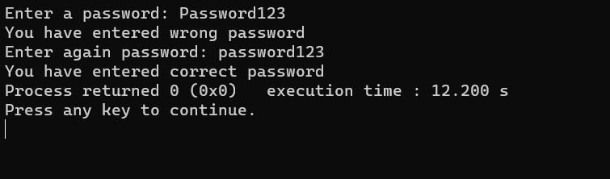

# Mastering Password Validation



## Introduction

Welcome to the "Mastering Password Validation" project! This repository hosts an interactive program designed to help you master the art of password validation. The program continuously executes until you input the correct password, making it a fantastic tool for learning and practicing password security.

## Features

- **Interactive Learning**: Dive into the world of password validation with an interactive environment to practice and enhance your skills.

- **Continuous Loop**: The program's loop continues until you successfully input the correct password, providing a hands-on learning experience.

- **Educational Tool**: Ideal for educational purposes and understanding the importance of strong password security.

## Demo

See the program in action:


## Installation

To run the program locally, follow these steps:

1. Clone this repository:
   ```shell
   git clone https://github.com/iMamoonAkhter/Mastering_Password_Validation.git
